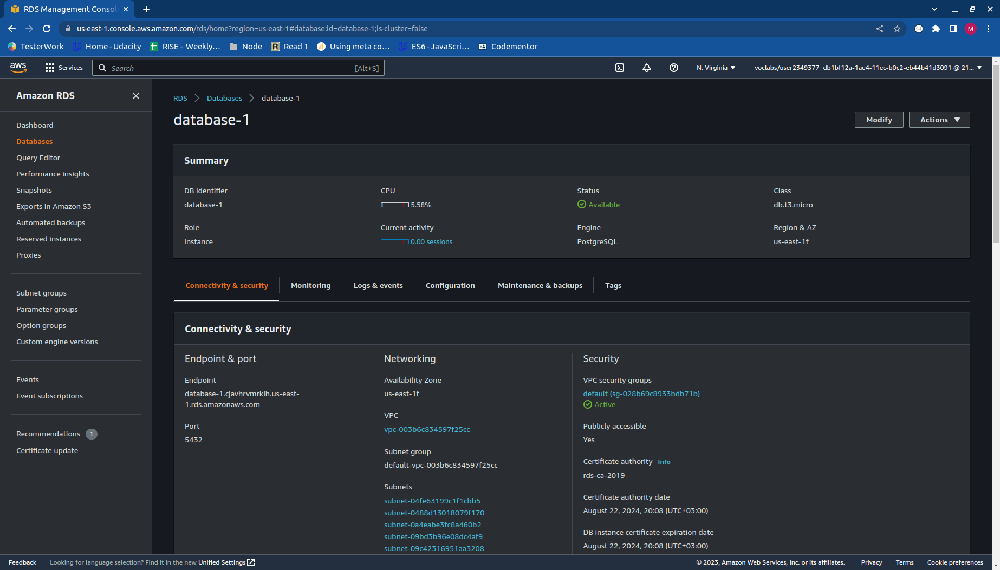

# Hosting a Full-Stack Application
The 4th and final project in my journey with Udacity doing Full-Stack JavaScript Developer Nano Degree. Udagram is an app provide by Udacity as a starter code. The goal of this project is Deploy a full-stack application is AWS and automate the deployment process using CirculCI.

## Frontend link:
http://marzoogudagram.s3-website-us-east-1.amazonaws.com/home

## Screenshots:

#### Frontend:

#### S3

#### RDS:

#### Elastic Beanstalk:

